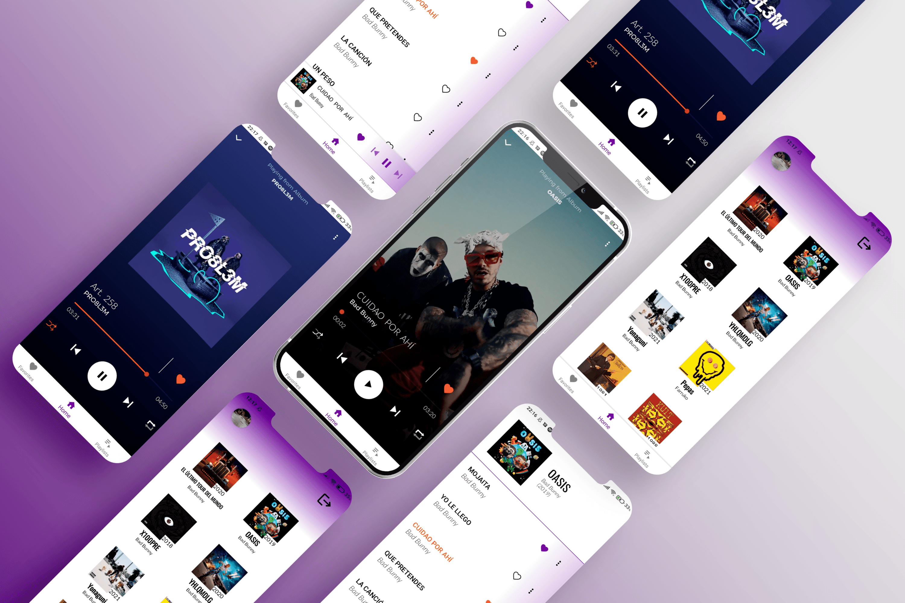

## 💻 Projects

  
 
  <h3 align="center">🎵 Altas Notas 🎵 (Private)<h3>
  <h4 align="center">Music Player based on Firebase Services</h4>
  
  
 
  <h3 align="center">☁️ Weather Forecast ☁️<h3>
  <h4 align="center">Available on <a href="https://play.google.com/store/apps/details?id=com.company.elverano"><b>Google Play</b></a>!</h4>
  
  

  <h3 align="center"> Youtube - TV <h3>
  <h5 align="center">In progress<h5>
    

  <table border="1">
<thead>
  <tr>
    <th>Light mode</th>
    <th>Dark mode</th>
  </tr>
</thead>
<tbody>
  <tr>
    <td></td>
    <td></td>
  </tr>
  <tr>
    <td></td>
    <td></td>
  </tr>
<tr>
    <td></td>
    <td></td>
</tr>
</tbody>
</table>
    

