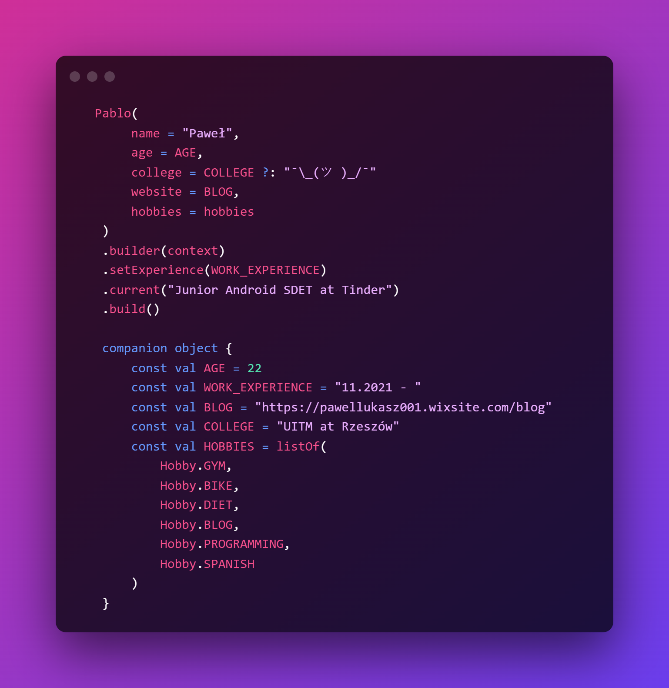

##  🏘️ Greetings       

   

## 📗 Blog  <a href="https://pawellukasz001.wixsite.com/blog">Mobile Pablo</a>

## 💻 Projects

  
 
  <h3 align="center">🎵 Altas Notas 🎵<h3>
  <h4 align="center">Music Player based on Firebase Services</h4>
  
  
 
  <h3 align="center">☁️ Weather Forecast ☁️<h3>
  <h4 align="center">Available on <a href="https://play.google.com/store/apps/details?id=com.company.elverano"><b>Google Play</b></a>!</h4>
  
  

  <h3 align="center">🌱 Flora 🌱<h3>
  <h5 align="center">In progress<h5>
